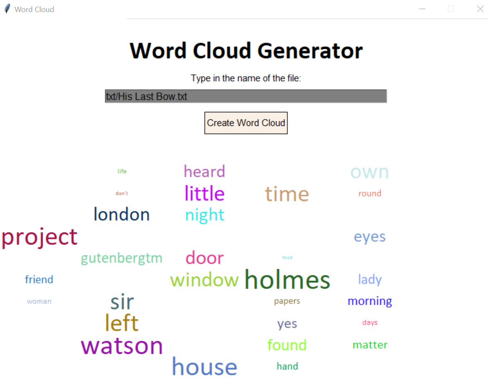
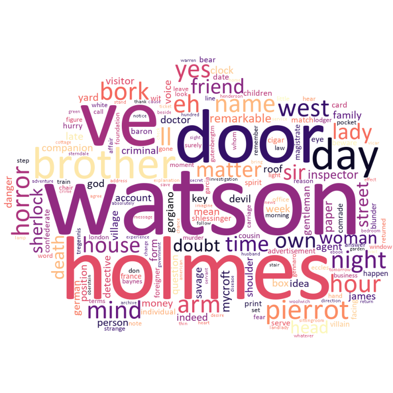

# Word Cloud

A Word Cloud generator developed in Python with the help of John Zelle's graphics module. Two version are available, one with the help of wordcloud package and one without.

Version 1:
<br/>


Version 2:
<br/>


## Installation

Clone the repo to your local machine.

For version 1: run wordcloud_raw1.py or wordcloud_raw2.py
<br/>

For version 2: use the package manager [pip](https://pip.pypa.io/en/stable/) to install wordcloud, matplotlib, pillow. Note that C compiler is needed for the wordcloud package. After all requirements are satisfied, run wordcloud_lib.py

```bash
pip install wordcloud
pip install matplotlib
pip install pillow

```

## Problems and Future Update

Revise the code for wordcloud_raw1.py while keeping the logic, currently it takes too long to run and may encounter errors. <br/>

Add exit button and user manual for both raw1 and raw2 <br/>

Add options for masking image for wordcloud_lib.py


## Contributing
Pull requests are welcome. For major changes, please open an issue first to discuss what you would like to change.

Please make sure to update tests as appropriate.
